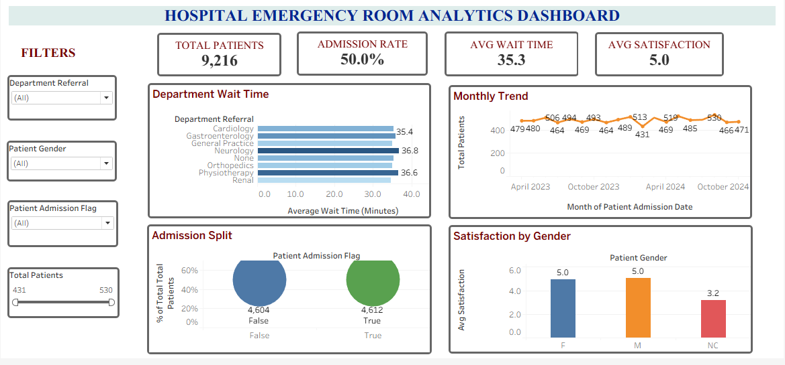

#  Hospital Emergency Room Analytics Dashboard

##  Project Overview

The **Hospital Emergency Room Analytics Dashboard** is an end-to-end healthcare analytics project that analyzes emergency department operations using **Python, SQL, and Tableau**.

The project transforms raw hospital emergency room data into meaningful insights by analyzing **patient volume, admission patterns, waiting time performance, department efficiency, and patient satisfaction**.

The objective is to support healthcare decision-makers with data-driven insights for improving operational efficiency, resource allocation, and patient experience.

---

##  Business Objectives

- Analyze overall emergency room patient volume.
- Identify departments with higher patient waiting times.
- Understand admission and discharge patterns.
- Analyze patient arrival trends over time.
- Evaluate patient satisfaction levels.
- Develop an interactive dashboard for healthcare performance monitoring.

---

##  Technology Stack

| Technology | Usage |
|------------|-------|
| Python | Data cleaning, preprocessing, and exploratory analysis |
| Pandas | Data manipulation and transformation |
| Matplotlib | Data visualization |
| SQL | Business analysis and KPI extraction |
| Tableau | Interactive dashboard development |
| CSV | Data source |

---

##  Project Workflow

```
Raw Hospital ER Dataset
          ↓
Data Cleaning & Preprocessing
          ↓
Exploratory Data Analysis using Python
          ↓
SQL Business Analysis
          ↓
Tableau Dashboard Development
          ↓
Insights & Recommendations
```

---

#  Dataset Description

The dataset contains emergency room patient records with the following attributes:

- Patient ID
- Admission Date
- Patient Age
- Gender
- Race
- Department Referral
- Admission Status
- Waiting Time
- Patient Satisfaction Score

---

#  Data Analysis Using Python

## Data Preparation

Performed data cleaning and preprocessing:

- Loaded and explored the dataset using Pandas.
- Handled missing values and duplicate records.
- Converted admission dates into datetime format.
- Created additional analytical features.

## Feature Engineering

Generated new features:

| Feature | Purpose |
|---------|---------|
| Month | Analyze monthly patient trends |
| Day of Week | Identify daily patient patterns |
| Age Group | Perform demographic segmentation |

---

#  SQL Business Analysis

SQL queries were developed to answer key healthcare business questions:

### 1. Patient Volume Analysis
**Question:** How many patients visited the emergency room?

**Insight:**  
The hospital handled **9,216 emergency patient visits**, indicating consistent healthcare demand.

---

### 2. Department Performance Analysis
**Question:** Which departments receive more patient referrals?

**Insight:**  
Department-level analysis helps identify patient demand and improve resource planning.

---

### 3. Waiting Time Analysis
**Question:** Which departments have longer waiting times?

**Insight:**  
Neurology and Physiotherapy showed higher waiting times, indicating possible operational bottlenecks.

---

### 4. Admission Analysis
**Question:** What percentage of patients require admission?

**Insight:**  
Approximately **50% of patients were admitted**, while the remaining patients were treated without hospitalization.

---

### 5. Patient Trend Analysis
**Question:** How does patient volume change over time?

**Insight:**  
Monthly patient arrivals remained stable throughout the analysis period.

---

#  Key Performance Indicators (KPIs)

| KPI | Value |
|-----|-------|
| Total Patients | 9,216 |
| Average Waiting Time | 35.3 Minutes |
| Admission Rate | 50% |
| Average Satisfaction Score | 5.0 / 10 |

---

#  Tableau Dashboard

An interactive Tableau dashboard was developed to monitor emergency room performance.

## Dashboard Components

### KPI Cards
- Total Patients
- Admission Rate
- Average Waiting Time
- Patient Satisfaction Score

### Visualizations

**1. Department Waiting Time Analysis**
- Identifies departments requiring operational improvements.

**2. Monthly Patient Trend**
- Shows patient arrival patterns and supports staffing decisions.

**3. Admission Status Analysis**
- Compares admitted and non-admitted patients.

**4. Satisfaction Analysis**
- Evaluates patient experience trends.

---

#  Business Insights

### Patient Volume
- Emergency services managed **9,216 patients**.
- Patient demand remained consistent.

### Waiting Time Performance
- Overall waiting time was **35.3 minutes**.
- Neurology experienced the highest waiting time.

### Admission Pattern
- The hospital maintained a balanced admission rate of **50%**.

### Patient Satisfaction
- Satisfaction score was **5.0/10**.
- Improving waiting time and communication can enhance patient experience.

---

#  Recommendations

Based on the analysis:

- Improve staffing allocation in high waiting-time departments.
- Optimize emergency triage and patient flow processes.
- Monitor department performance regularly.
- Improve communication with patients.
- Use analytics dashboards for operational decision-making.

---

#  Skills Demonstrated

- Data Cleaning & Preprocessing
- Exploratory Data Analysis (EDA)
- Feature Engineering
- KPI Development
- SQL Query Writing
- Business Intelligence
- Data Visualization
- Tableau Dashboard Development
- Healthcare Analytics

---

# Conclusion

The **Hospital Emergency Room Analytics Dashboard** demonstrates a complete healthcare analytics workflow using **Python, SQL, and Tableau**.

The project successfully converts raw hospital data into actionable insights by identifying patient trends, operational challenges, waiting time issues, and satisfaction patterns.

The interactive dashboard enables healthcare stakeholders to make informed decisions and improve emergency department efficiency.

# Dashboard Preview



---
